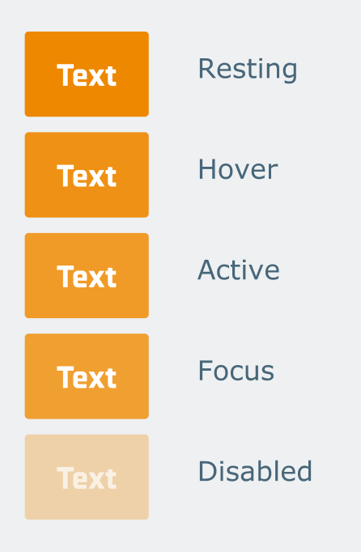

## Getting Started

First, run the development server:

```bash
pnpm install
pnpm dev
```

Open [http://localhost:3000](http://localhost:3000) with your browser to see the result.

## Objectives

- Create a button component with styles

```css
padding: 10px 16px;
border-radius: 2px;
background: #ed8800;
color: #ffffff;
```

- Add action styles

<details>
  <summary>Button actions example</summary>

  
</details>

- Add variants styles

<details>
  <summary>Button variants example</summary>

  
</details>

## Learn More

- [Tailwind Docs](https://tailwindcss.com/docs/installation)
